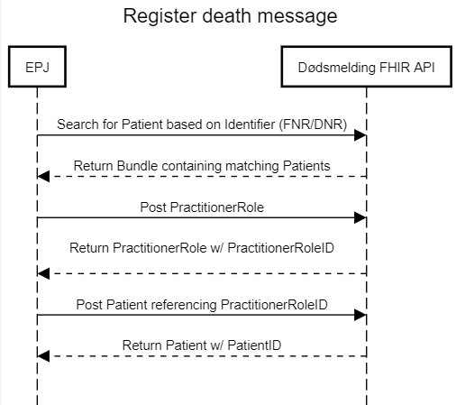
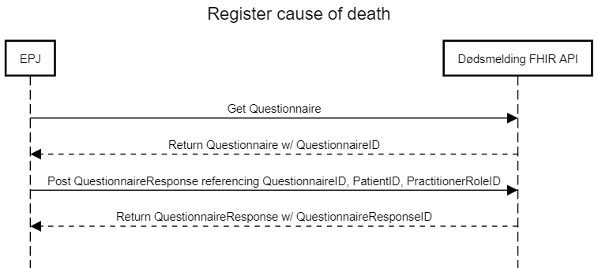

## Use cases

### Register death message
Sending a death message is initiated by searching for a Patient based on its Identifier (either FNR or DNR), which will return a Bundle object containing matching Patients. 

Then, if a PractitionerRoleID for the registering user is not available, a PractitionerRole object with contact information should be posted to receive one.

Finally, the patient should be posted with a valid Identifier, DeceasedDate, and PractitionerRoleID, which will send the information to the Norwegian tax office and return the Patient object including its PatientID.



### Register cause of death
Sending a cause of death message starts by calling a GET on the Questionnaire resource, which contains information about the questions and possible answers. 

The QuestionnaireResponse should contain the QuestionnaireID, PatientID, PractitionerRoleID. Posting it will send the answers to FHI, and return the same object with a QuestionnaireResponseID.




***
**Note**: The answerValueSet of the questions asking directly about cause of death is quite large (~22000 codes) and is frequently updated by FHI. It therefore refers to a separate endpoint which will return the ValueSet. 

**Questionnaire example**
Sending a GET request to http://{environment}/Questionnaire/1 will return the cause of death questionnaire in JSON-format. Only one question is shown here for brevity, but the whole response can be found [here](../ElektroniskDodsmelding.Samples/Sample%20requests/QuestionnaireSample.md).

A couple of things to note:
* The questionnaire uses the FHIR extension [constraint](http://hl7.org/fhir/StructureDefinition/questionnaire-constraint) in order to enforce some of the more complex rules, e.g. at least one cause of death must be registered.
* The questionnaire items are structured in a hierarchical manner. Each item in the outermost layer are of type group and contains related questions. 
* The set of possible answers is included in most of the questions through the answerOption field. The exceptions are the ICD-10 and municipality code sets, which due to their size use the answerValueSet field. It contains the absolute URL to the endpoint for searching in the code sets. 
```json
{
    "resourceType": "Questionnaire",
    "id": "1",
    "meta": {
        "versionId": "1.0"
    },
    "extension": [
        {
            "extension": [
                {
                    "url": "key",
                    "valueString": "MinstEtArsaksfeltSkalVæreUtfylt"
                },
                {
                    "url": "severity",
                    "valueString": "error"
                },
                {
                    "url": "human",
                    "valueString": "Minst ett årsaksfelt skal være utfylt"
                },
                {
                    "url": "expression",
                    "valueString": "%resource.repeat(item).where(linkId='3_causeOfDeath_group').item.where(answer.hasValue()).count() > 0"
                }
            ],
            "url": "http://hl7.org/fhir/StructureDefinition/questionnaire-constraint"
        }
    ],
    "name": "dodsaarsak_1",
    "title": "Dødsårsak",
    "status": "draft",
    "publisher": "Norsk helsenett",
    "description": "Skjema for å fylle ut en dødsårsak som er knyttet til et dødsfall",
    "purpose": "Skjema som skal utfylles av lege ved et dødsfall for å registrere dødsårsak til FHI",
    "item": [
        {
            "linkId": "1_timeOfDeath_group",
            "text": "Klokkeslett for dødsfall",
            "type": "group",
            "item": [
                {
                    "linkId": "timeOfDeath",
                    "text": "Hvis kjent, når omtrent på døgnet inntraff døden? Rund av hvis du er usikker.",
                    "type": "time",
                    "required": true,
                    "repeats": false
                }
            ]
        },
        ...
    ]
}
```

**QuestionnaireResponse example**
The QuestionnareResponse will contain the Questionnaire answers and result in a validated cause of death registration. 
The response will contain a summary of the the cause of death registration.

A cause of death registration request with only one answer is shown here for brevity, the whole request and response can be found [here](../ElektroniskDodsmelding.Samples/Sample%20requests/QuestionnaireResponseSample.md).
```json
{
    "resourceType": "QuestionnaireResponse",
    "questionnaire": "/Questionnaire/1",
    "status": "completed",
    "subject": {
        "reference": "Patient/1028"
    },
    "author": {
        "reference": "PractitionerRole/3024"
    },
    "item": [
        {
            "linkId": "timeOfDeath_group",
            "item": [
                {
                    "linkId": "timeOfDeath",
                    "answer": [
                        {
                            "valueTime": "10:00:00"
                        }
                    ]
                }
            ]
        },
        .....
   ]
}
```

Results in a response with a cause of death registgration summary like this:
```json
{
    "resourceType": "QuestionnaireResponse",
    "id": "b4e8d4cb-9a3a-41c2-8297-f11199b5bb54",
    "questionnaire": "1",
    "status": "completed",
    "subject": {
        "reference": "https://dodsmelding-fhir.utvikling.nhn.no/Patient/1028"
    },
    "authored": "2021-12-20T18:35:20.4396618+01:00",
    "author": {
        "reference": "https://dodsmelding-fhir.utvikling.nhn.no/PractitionerRole/3024"
    }
}
```

***

## Error handling

All our Fhir resources can return detailed error messages in terms of an OperationOutcome. More about Fhir OperationOutcome can be found [here](http://www.hl7.org/fhir/operationoutcome.html).
Errors thrown during validation or processing will result in an issue in the OperationOutcome response. Each error are presented as an issue with 
its readable message and detail that identifies the error within the system.

There are mainly two sets of issues: 
* Custom errors thrown during validation or processing results in issues from system https://github.com/HL7Norway/ElektroniskDodsmelding
* Generall Fhir errors results in issues from system http://hl7.org/fhir/dotnet-api-operation-outcome 

**OperationOutcome example** : An invalid QuestionnaireResponse request that resulted in a response with HttpStatus 500 (Internal Server Error) containing an OperationOutcome.
```json
{
    "resourceType": "OperationOutcome",
    "id": "f14b366e-6c45-4f90-95c3-0ce9298bf974",
    "meta": {
        "versionId": "9a50fbfe-6cc4-453c-91b7-adbe33ad6235",
        "lastUpdated": "2021-12-20T17:06:06.9512308+00:00"
    },
    "issue": [
        {
            "severity": "error",
            "code": "business-rule",
            "details": {
                "coding": [
                    {
                        "system": "https://github.com/HL7Norway/ElektroniskDodsmelding",
                        "code": "0004"
                    }
                ]
            },
            "diagnostics": "Ugyldig kode for «Blir politiet varslet om unaturlig dødsfall»"
        },
        {
            "severity": "error",
            "code": "exception",
            "details": {
                "coding": [
                    {
                        "system": "http://hl7.org/fhir/dotnet-api-operation-outcome",
                        "code": "5010"
                    }
                ],
                "text": "Internal processing error."
            }
        }
    ]
}

```
***